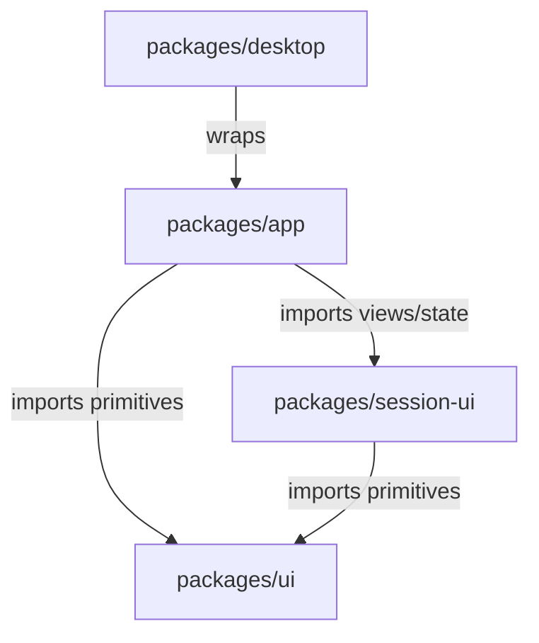

# UI Path Introduction

This document maps out the UI component structure, directory paths, and active versioning rules for this repository. It serves as a single reference point to understand where UI components live, how they connect, and which ones are currently used in production.

---

## 1. UI Package Architecture

The frontend is built using **Solid.js**, **Tailwind CSS**, and **Kobalte**. It is structured as a monorepo containing three main UI-related packages under the [packages](file:///c:/Users/sera/Desktop/shobcoder/packages) directory, plus a desktop wrapper package:



### Key Packages:
1. **[packages/ui](file:///c:/Users/sera/Desktop/shobcoder/packages/ui)**: The foundation layer. Contains atomic and generic design system components (buttons, dialogs, checkboxes, tooltips, etc.).
2. **[packages/session-ui](file:///c:/Users/sera/Desktop/shobcoder/packages/session-ui)**: The agent interaction layer. Contains components specific to conversation transcripts, execution timeline, tool output bubbles, diff views, and line-comment interfaces.
3. **[packages/app](file:///c:/Users/sera/Desktop/shobcoder/packages/app)**: The application shell. Orchestrates pages (Home, Session, Settings), layouts, navigation tabs, title bars, terminal/WSL bindings, and state providers.
4. **[packages/desktop](file:///c:/Users/sera/Desktop/shobcoder/packages/desktop)**: The Electron desktop wrapper, which manages OS menus, windows, file dialogs, and runs the Solid.js web app.

---

## 2. Component Paths: V1 (Legacy) vs V2 (New)

The codebase is currently transitioning from V1 (original design) to V2 (new design system and refined aesthetics). Both versions exist side-by-side.

These versions are not a strict fork: V2 components are co-located beside V1 with a `-v2` suffix, and both are imported through the same package entrypoints (`@shob/ui`, `@shob/ui/v2`, `@shob/session-ui`). A few primitives are shared across versions rather than duplicated — most notably `icon.tsx` lives in both `packages/ui/src/components` and `packages/ui/src/v2/components` and is imported as `Icon` / `IconV2` respectively.

### A. Generic UI Components (`@shob/ui`)
* **V1 / Legacy Components**:
  * **Path**: [packages/ui/src/components](file:///c:/Users/sera/Desktop/shobcoder/packages/ui/src/components)
  * **Examples**: `button.tsx`, `dialog.tsx`, `select.tsx`, `switch.tsx`, `tabs.tsx`, `tooltip.tsx`, `checkbox.tsx`, `avatar.tsx`, `card.tsx`, `popover.tsx`, `dropdown-menu.tsx`, `scroll-view.tsx`, `icon.tsx`.
* **V2 / New Components**:
  * **Path**: [packages/ui/src/v2/components](file:///c:/Users/sera/Desktop/shobcoder/packages/ui/src/v2/components)
  * **Examples**: `button-v2.tsx`, `dialog-v2.tsx`, `select-v2.tsx`, `switch-v2.tsx`, `tabs-v2.tsx`, `tooltip-v2.tsx`, `badge-v2.tsx`, `field-v2.tsx`, `avatar-v2.tsx`, `checkbox-v2.tsx`, `menu-v2.tsx`, `text-input-v2.tsx`, `textarea-v2.tsx`, `icon-button-v2.tsx`, `divider-v2.tsx`, `segmented-control-v2.tsx`, `radio-v2.tsx`, `project-avatar-v2.tsx`, `file-tree-v2.tsx`, `line-comment-v2.tsx`, `loader-v2.tsx`, `toast-v2.tsx`, `accordion-v2.tsx`, `progress-circle-v2.tsx`, `keybind-v2.tsx`, `text-shimmer-v2.tsx`, `wordmark-v2.tsx`.

### B. Agent/Session-Specific Components (`@shob/session-ui`)
* **V1 / Legacy Components**:
  * **Path**: [packages/session-ui/src/components](file:///c:/Users/sera/Desktop/shobcoder/packages/session-ui/src/components)
  * **Examples**: `basic-tool.tsx`, `message-part.tsx`, `session-turn.tsx`, `session-review.tsx`, `tool-error-card.tsx`, `line-comment-annotations.tsx`, `markdown.tsx`, `file.tsx`, `session-diff.tsx`, `session-retry.tsx`.
* **V2 / New Components**:
  * **Path**: [packages/session-ui/src/v2/components](file:///c:/Users/sera/Desktop/shobcoder/packages/session-ui/src/v2/components)
  * **Examples**: `basic-tool-v2.tsx`, `session-review-v2.tsx`, `tool-error-card-v2.tsx`, `session-progress-indicator-v2.tsx`, `line-comment-annotations-v2.tsx`, `session-review-file-preview-v2.tsx`, `session-review-empty-changes-v2.tsx`, `session-review-empty-no-git-v2.tsx`.

---

## 3. Page and Layout Routing Connection

The application routing is configured in [packages/app/src/app.tsx](file:///c:/Users/sera/Desktop/shobcoder/packages/app/src/app.tsx). It maps the visual shell and selects pages based on user settings and route entries.

### A. App Shell Layouts
* **V1 Layout (Legacy)**: [packages/app/src/pages/layout.tsx](file:///c:/Users/sera/Desktop/shobcoder/packages/app/src/pages/layout.tsx)
  * A multi-pane layout featuring drag-and-drop capabilities. Used in legacy workspace session routes.
* **V2 Layout (New)**: [packages/app/src/pages/layout-new.tsx](file:///c:/Users/sera/Desktop/shobcoder/packages/app/src/pages/layout-new.tsx)
  * The current default layout shell, providing a sidebar for project navigation, session management, and quick draft creation.

### B. Route Definitions (from [app.tsx](file:///c:/Users/sera/Desktop/shobcoder/packages/app/src/app.tsx))
* **Home Screen**:
  * **Path**: [packages/app/src/pages/home.tsx](file:///c:/Users/sera/Desktop/shobcoder/packages/app/src/pages/home.tsx)
  * Contains both `NewHome` and `LegacyHome`. The new home view leverages V2 buttons, avatars, and menus.
* **Session Details Screen**:
  * **Path**: [packages/app/src/pages/session.tsx](file:///c:/Users/sera/Desktop/shobcoder/packages/app/src/pages/session.tsx)
  * Renders session state, logs, files, and links execution streams.
  * Timeline rendering flows are driven by components in [packages/app/src/pages/session/timeline](file:///c:/Users/sera/Desktop/shobcoder/packages/app/src/pages/session/timeline).
  * Prompts and user inputs are built under [packages/app/src/pages/session/composer](file:///c:/Users/sera/Desktop/shobcoder/packages/app/src/pages/session/composer).
  * V2 review and file lists reside in [packages/app/src/pages/session/v2](file:///c:/Users/sera/Desktop/shobcoder/packages/app/src/pages/session/v2).
* **Settings Dialog / Page**:
  * **V1 Path**: [packages/app/src/components/settings-dialog.tsx](file:///c:/Users/sera/Desktop/shobcoder/packages/app/src/components/settings-dialog.tsx) (plus sibling `settings-general.tsx`, `settings-models.tsx`, `settings-providers.tsx`, `settings-servers.tsx`, `settings-keybinds.tsx`, `settings-list.tsx`, `settings-server-picker.tsx`).
  * **V2 Path**: [packages/app/src/components/settings-v2](file:///c:/Users/sera/Desktop/shobcoder/packages/app/src/components/settings-v2). `index.tsx` re-exports `SettingsPage` from `dialog-settings-v2.tsx`. Includes page modules `general.tsx`, `models.tsx`, `providers.tsx`, `servers.tsx`, the `dialog-server-v2.tsx` server editor, and a `parts/` folder (`list.tsx`, `row.tsx`) for shared list/row primitives in the new UI style.

---

## 4. Current Default / Active Version Status

Currently, the application **defaults to the V2 (New) Design**:

1. **Layout Enforced**: In [app.tsx](file:///c:/Users/sera/Desktop/shobcoder/packages/app/src/app.tsx), `AppInterface` wraps the router context in `<NewAppLayout>`, which injects `NewLayout` ([layout-new.tsx](file:///c:/Users/sera/Desktop/shobcoder/packages/app/src/pages/layout-new.tsx)).
2. **Body CSS Attributes**: In [app.tsx](file:///c:/Users/sera/Desktop/shobcoder/packages/app/src/app.tsx), `BodyDesignClass()` mounts and unconditionally forces the V2 design on. `enabled` is hardcoded to `true` (there is no live toggle back to V1 styling), so the function only ever sets V2 attributes/classes and removes the legacy `text-12-regular` class:
   ```ts
   const enabled = true
   document.body.toggleAttribute("data-new-layout", enabled)
   document.body.classList.toggle("text-12-regular", !enabled)
   document.body.classList.toggle("font-(family-name:--font-family-text)", enabled)
   document.body.classList.toggle("text-[13px]", enabled)
   document.body.classList.toggle("font-[440]", enabled)
   ```
   `data-new-layout` flags all selectors to leverage the V2 design patterns, while the class toggles switch the base typography from the legacy 12px regular scale to the V2 13px / weight-440 scale.
3. **Route Mappings** (from the `Routes()` table in [app.tsx](file:///c:/Users/sera/Desktop/shobcoder/packages/app/src/app.tsx)):
   * `/` resolves to `NewHome`.
   * `/settings` resolves to the V2 `SettingsPage` (via `SettingsRoute` → `settings-v2`).
   * `/server/:serverKey/session/:id` is the **active session flow** (`TargetSessionRoute`), server-scoped and the canonical session URL.
   * `/new-session` is the draft/composer flow (`DraftRoute` → `NewSession`), keyed to a `draftId`.
   * `/:dir` (legacy `DirectoryLayout`) and `/:dir/session/:id` (`LegacyTargetSessionRoute`) are **legacy routes that redirect** into the server-scoped flow under `/server/:serverKey/session/:id`. They no longer render standalone V1 session UI.

---

## 5. Styling and Theme Configuration

Styles are aggregated in the main app entry style sheet [packages/app/src/index.css](file:///c:/Users/sera/Desktop/shobcoder/packages/app/src/index.css), which links stylesheet files across modules:

```css
@import "@shob/ui/styles/tailwind";
@import "@shob/session-ui/styles";
@import "@shob/ui/v2/styles/tailwind.css";
@import "tw-animate-css";
```

- `@shob/ui/styles/tailwind` resolves to the V1 Tailwind entry in `packages/ui/src/styles`.
- `@shob/session-ui/styles` resolves to `packages/session-ui/src/styles/index.css` via the package `exports` map (there is no `styles/` directory — it is a single aggregated stylesheet).
- `@shob/ui/v2/styles/tailwind.css` resolves to `packages/ui/src/v2/styles/tailwind.css`.
- `tw-animate-css` is the animation utility layer used by both layouts.

### CSS Variables & Themes
- **V1 Styles**: Located in [packages/ui/src/styles](file:///c:/Users/sera/Desktop/shobcoder/packages/ui/src/styles). Files: `index.css`, `base.css`, `theme.css`, `colors.css`, `animations.css`, `utilities.css`, plus the `tailwind` entry. Defines base layouts, standard colors, and animations.
- **V2 Styles**: Located in [packages/ui/src/v2/styles](file:///c:/Users/sera/Desktop/shobcoder/packages/ui/src/v2/styles). Files: `tailwind.css`, `theme.css`, `colors.css`. Defines refined themes (`theme.css`) and dark/light color maps (`colors.css`).
- **Icons**: Shared across versions, generated from SVG sprite configurations in [packages/ui/vite.config.ts](file:///c:/Users/sera/Desktop/shobcoder/packages/ui/vite.config.ts), and exposed through Solid icon components (e.g., [packages/ui/src/v2/components/icon.tsx](file:///c:/Users/sera/Desktop/shobcoder/packages/ui/src/v2/components/icon.tsx) for V2 and `packages/ui/src/components/icon.tsx` for V1). V2 components import it as `Icon as IconV2`.
